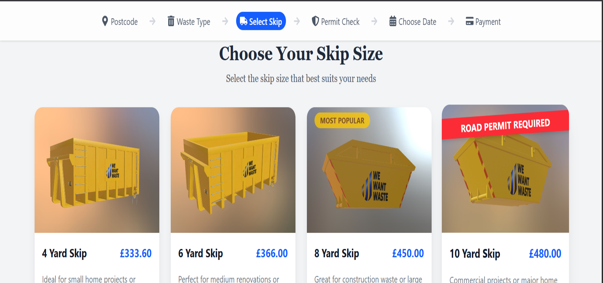

# WeWantWaste Skip Selector

A responsive React-based interface to help users select the right skip (waste container) based on size, availability, and placement permissions.

## 📷 Screenshot


## 🚀 Project Overview

This project allows users to:
- Fetch available skip sizes for a specified location.
- View skip sizes with descriptions, images, and pricing.
- Determine if a skip can be placed on the road or requires a permit.
- Select and proceed with the chosen skip for further delivery and payment steps.

## 🔧 Technologies Used

- **React + TypeScript** – for type-safe, maintainable components.
- **Tailwind CSS** – for utility-first styling.
- **Axios** – for API requests.
- **React Icons** – for modern and expressive UI icons.
- **Vite** – for fast development and build process.

## 📁 Project Structure

```
src/
├── App.tsx                     # Root component
├── assets/                    # Skip size images
├── components/                # Reusable UI components
│   ├── Topbar.tsx             # Navigation for booking steps
│   └── WasteCard.tsx          # Displays individual skip options
├── pages/
│   └── Homepage.tsx           # Main skip selection interface
├── types/
│   └── index.ts               # TypeScript types (e.g. Skip interface)
├── hooks/
│   └── useSkips.ts            # (Optional) could house skip-fetching logic
├── index.css                  # TailwindCSS styles
└── main.tsx                   # Vite entry point
```

## 🧠 My Approach

1. **Modular Design:**
   - Code is broken down into clear components like `Topbar` and `WasteCard`.
   - `Homepage.tsx` handles state management and API integration.

2. **Type Safety:**
   - A `Skip` type is defined in `types/index.ts` to ensure consistent structure of API data.

3. **User Experience:**
   - A step-based top bar helps users track progress.
   - Loading spinner and error messages provide feedback during API operations.
   - Clear visual cues: permit warnings, selection highlights, and badges (e.g., “Most Popular”).

4. **Visual Enhancements:**
   - Uses animated icons and transitions for a polished feel.
   - Conditional rendering shows skip-specific details like permit needs.

5. **Error & Loading States:**
   - Robust UI that handles API failures and loading gracefully.

6. **Scalability:**
   - Easily extendable to include more booking steps like delivery date and payment.


## 🧪 Running the Project

```bash
bun install
bun run dev
```

Make sure you have the latest version of Node.js and Vite installed.

## 📡 API Used

Skips are fetched from:
```
https://app.wewantwaste.co.uk/api/skips/by-location?postcode=NR32&area=Lowestoft
```

## 📬 Contact

Developed by Isaac Mwiti Kubai.

Feel free to fork, modify, or reach out if you'd like to contribute or ask questions.
