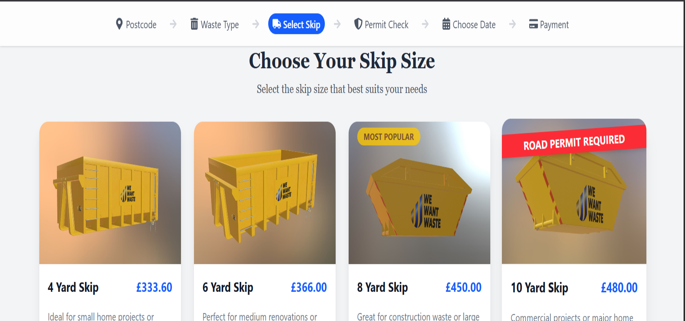

# We Want Waste Platform

The We Want Waste platform is a web application designed to help users select and book skip sizes for waste management in Lowestoft, UK. This README outlines the project's purpose, structure, approach to development, key changes made, and instructions for setup and running the application.

# Page Sample



## Project Overview

The application allows users to:
- View a list of available skips fetched from an API based on a specific postcode (NR32) and area (Lowestoft).
- Select a skip size that suits their project needs, with visual indicators for selection and hover states.
- Navigate through a multi-step booking process (Postcode, Waste Type, Select Skip, Permit Check, Choose Date, Payment) via a responsive topbar.
- See dynamic pricing, hire periods, and permit requirements for each skip.

The frontend is built with **React**, **TypeScript**, and **Tailwind CSS**, leveraging **Vite** as the build tool. The application uses **Axios** for API requests and **react-icons** for UI icons.

## Approach

The development approach focused on enhancing usability, responsiveness, and maintainability while adhering to modern web design trends. Key objectives included:
- **Responsive Design**: Ensuring the UI is accessible and visually appealing on both desktop and mobile devices.
- **User Experience**: Improving navigation with a modern topbar, clear visual feedback for skip selection, and optimized layouts.
- **Code Quality**: Using TypeScript for type safety, modular components, and clear documentation.
- **Performance**: Optimizing image loading with local assets and handling API errors gracefully.

### Key Changes and Enhancements

1. **Homepage Layout Optimization**:
   - Modified the skip card grid to display **four cards per row** on large screens (`lg:grid-cols-4`) for better use of space, while maintaining two columns on smaller screens (`sm:grid-cols-2`) and one on mobile (`grid-cols-1`).
   - Reduced vertical height by adjusting padding (`py-8` to `pb-10`), margins (`mb-12` to `mb-8`, `mt-16` to `mt-12`), and minimum height (`min-h-screen` to `min-h-[50vh]`).
   - Added a **footer** with a disclaimer about imagery and pricing variations.
   - Improved loading and error states with modern UI elements (e.g., glassmorphism with `backdrop-blur-md` for the loading spinner).

2. **Responsive Topbar**:
   - Replaced the original progress bar with a **modern topbar** (`Topbar.tsx`) featuring:
     - A fixed position with glassmorphism styling (`bg-white/80 backdrop-blur-md`).
     - A logo placeholder (assumed at `src/assets/logo.png`) and brand name.
     - Progress steps displayed horizontally on desktop with active state highlighting (`bg-blue-600 text-white`).
     - A mobile-friendly dropdown menu toggled by a hamburger icon (`FaBars`/`FaTimes`), showing steps vertically with a "Get a Quote" CTA.
   - Ensured mobile responsiveness by hiding steps on small screens (`sm:hidden`) and using a toggleable menu to prevent overflow.
   - Adjusted main content padding (`pt-20`) to account for the fixed topbar height.

3. **WasteCard Enhancements**:
   - Switched from Unsplash URLs to **local images** in `src/assets` for skip photos, using explicit imports (`image.png`, `image2.png`, etc.) mapped to skip sizes.
   - Considered dynamic imports but retained explicit imports for simplicity, as the number of images is fixed.
   - Improved button UX by replacing the text arrow with a larger `FaArrowRight` icon (`h-5 w-5`) and aligning it with text using `flex items-center`.
   - Aligned the `FaCalendarDays` icon and hire period text inline using `flex items-center` with `mr-2` for spacing.
   - Added visual indicators (e.g., "MOST POPULAR" badge for 8-yard skips, "ROAD PERMIT REQUIRED" banner) with animations (`animate-pulse`, `animate-bounce`).

4. **Type Safety**:
   - Defined the `Skip` type in `types.ts` to ensure type safety for skip data (id, size, hire_period_days, price_before_vat, vat, allowed_on_road).
   - Used TypeScript interfaces for component props (`WasteCardProps`, `TopbarProps`) to enforce consistent data structures.

5. **Error Handling and Loading States**:
   - Implemented robust error handling for API requests with a user-friendly error UI and a "Retry" button.
   - Enhanced the loading state with a centered spinner and glassmorphism background for a modern look.

## Project Structure

```plaintext
src/
├── App.tsx                   # Root component rendering Homepage
├── assets/                   # Static assets (images for skips)
│   ├── image.png
│   ├── image2.png
│   ├── image3.png
│   ├── image4.png
│   ├── image5.png
│   ├── image6.png
│   └── react.svg
├── components/               # Reusable components
│   ├── ErrorDisplay.tsx      # (Not used in provided code)
│   ├── LoadingSpinner.tsx    # (Not used in provided code)
│   ├── Topbar.tsx            # Responsive topbar with progress steps
│   └── WasteCard.tsx         # Card component for displaying skip options
├── hooks/                    # Custom hooks
│   └── useSkips.ts           # (Not used in provided code)
├── pages/                    # Page components
│   └── Homepage.tsx          # Main page with skip selection
├── types/                    # TypeScript type definitions
│   └── index.ts              # Skip type definition
├── index.css                 # Global CSS (Tailwind)
├── main.tsx                  # Entry point
└── vite-env.d.ts             # Vite environment types